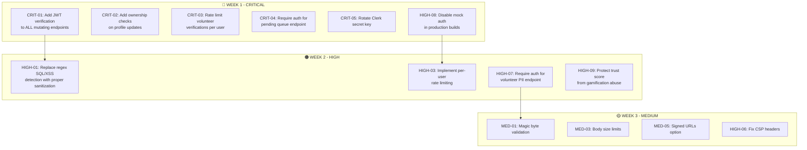

# 🔴 FixIndia.org — Complete Security & QA Audit Report

**Date:** 2026-05-23  
**Auditor:** Automated Security + QA Audit Engine  
**Scope:** Full-stack end-to-end — Backend API, Frontend SPA, Authentication, Database, Infrastructure  
**Verdict:** ⚠️ **NOT PRODUCTION-READY AT ENTERPRISE GRADE** — 7 Critical, 9 High, 15+ Medium/Low findings

---

## Table of Contents

1. [Application Understanding](#1-application-understanding)
2. [CRITICAL Findings (P0 — Fix Immediately)](#2-critical-findings-p0)
3. [HIGH Findings (P1 — Fix Before Deploy)](#3-high-findings-p1)
4. [MEDIUM Findings (P2 — Fix Soon)](#4-medium-findings-p2)
5. [LOW Findings (P3 — Nice to Fix)](#5-low-findings-p3)
6. [What's Working Great ✅](#6-whats-working-great)
7. [E2E Test Results](#7-e2e-test-results)
8. [Production Readiness Checklist](#8-production-readiness-checklist)
9. [Remediation Priority Matrix](#9-remediation-priority-matrix)

---

## 1. Application Understanding

**FixIndia.org** is a civic accountability platform with two portals:

| Portal | URL | Purpose |
|--------|-----|---------|
| **Citizen Map** | `fixindia.org` | Report potholes, broken footpaths, streetlights. View issues on a map. Upvote/verify reports. |
| **Volunteer Portal** | `help.fixindia.org` | Verify/correct MLA contact details, submit corrections for peer review, earn civic points. |

### Tech Stack

| Layer | Technology |
|-------|-----------|
| Frontend | React 19 + Vite 8 + TailwindCSS 4 + MapLibre GL + Framer Motion |
| Backend | Elysia (Bun runtime) on port 6969 |
| Auth | Clerk (Google OAuth) + Custom mock auth layer |
| Database | PostgreSQL 14+ with PostGIS |
| Storage | Storj DCS (S3-compatible, decentralized) |
| AI | Groq (Llama 3.3 70B) + OpenRouter fallback |
| Server | Oracle Cloud VPS at `129.159.228.26` |

### Key User Flows

1. **Guest → View Map** → Browse issues, read news, see leaderboards
2. **Sign In** → Clerk Google OAuth → fullscreen login console
3. **Report Issue** → Geolocation + photo upload → ward auto-detection → pending verification
4. **Verify Report** → 3 verifiers needed → auto-publish to map
5. **Volunteer Portal** → Sign in → Setup home area → Correct MLA details → Peer verification queue

---

## 2. CRITICAL Findings (P0)

> [!CAUTION]
> These vulnerabilities can lead to data breach, unauthorized access, or complete system compromise.

### CRIT-01: 🔴 ZERO Authentication on ALL Mutating API Endpoints

**File:** [server/src/index.ts](file:///Users/foxcorn/Documents/Experiments/fixindia/server/src/index.ts)

The backend server accepts the `Authorization: Bearer <token>` header but **NEVER validates it**. The token is passed through to `authHeaders()` on the frontend but the server never calls `Clerk.verifyToken()` or any JWT verification.

```
POST /api/reports          → No auth check
POST /api/reports/:id/upvote → No auth check  
POST /api/reports/:id/verify → No auth check
POST /api/volunteer/submit  → No auth check
POST /api/volunteer/verify/:id → No auth check
POST /api/users/sync        → No auth check
PUT  /api/users/clerk/:id   → No auth check
PUT  /api/users/:id         → No auth check
POST /api/mlas/:id/flag     → No auth check
POST /api/mlas/flag-by-name → No auth check
```

**Impact:** ANY anonymous user can:
- Submit fake reports flooding the map
- Upvote reports infinitely (different userId each time)
- Verify their own reports by faking verifier IDs
- Modify ANY user's profile (job title, socials, display name)
- Create fake users via `/api/users/sync`
- Flag all MLAs as incorrect
- Submit fake volunteer data

**Exploit (trivial):**
```bash
# Create a fake user with arbitrary clerkId
curl -X POST https://api.enjoyxd.eu.org/api/users/sync \
  -H "Content-Type: application/json" \
  -d '{"clerkId":"ATTACKER_123","displayName":"Evil Admin","email":"evil@example.com"}'

# Modify another user's profile
curl -X PUT https://api.enjoyxd.eu.org/api/users/clerk/real_user_id \
  -H "Content-Type: application/json" \
  -d '{"jobTitle":"HACKED","socials":{"twitter":"@hacked"}}'
```

**Fix:** Install `@clerk/backend` on the server, verify JWT tokens on every mutating endpoint using `clerkClient.verifyToken()`.

---

### CRIT-02: 🔴 Insecure Direct Object Reference (IDOR) — User Profile Manipulation

**File:** [server/src/index.ts#L774-L788](file:///Users/foxcorn/Documents/Experiments/fixindia/server/src/index.ts#L774-L788)

The `PUT /api/users/clerk/:clerkId` endpoint lets anyone update any user's profile by simply knowing their Clerk ID. There is **no ownership check** — the server doesn't verify that the authenticated user matches the `:clerkId` param.

```typescript
// Line 774 - No authorization check at all
.put('/api/users/clerk/:clerkId', async ({ params, body }) => {
    const { jobTitle, socials, homeConstituency, homeCity, homeState } = body as any;
    await sql`UPDATE users SET ... WHERE clerk_id = ${params.clerkId}`;
    return { success: true };
})
```

**Impact:** Profile takeover, impersonation, social engineering by modifying another user's visible details.

---

### CRIT-03: 🔴 Volunteer Verification System Has No Auth — Sybil Attack Vector

**File:** [server/src/volunteer_system.ts](file:///Users/foxcorn/Documents/Experiments/fixindia/server/src/volunteer_system.ts)

The verification system requires 3 approvals with a 67% approval ratio. But because there's no real authentication:

1. An attacker submits fake MLA data with `submittedBy: "attacker_1"`
2. The same attacker verifies it 3 times with `verifierId: "fake_2"`, `"fake_3"`, `"fake_4"`
3. The system auto-publishes the fake data into the production `mlas` table

The self-vote check (`submission.submitted_by === verifierId`) is easily bypassed by using different fake IDs.

**Impact:** Poisoning the entire MLA database with fabricated representative data.

---

### CRIT-04: 🔴 Pending Verifications Endpoint Returns ALL Data Without Auth

**File:** [server/src/index.ts#L703-L706](file:///Users/foxcorn/Documents/Experiments/fixindia/server/src/index.ts#L703-L706)

```typescript
// Line 703 - Anyone can see the entire pending queue
.get('/api/volunteer/pending', async () => {
    const pending = await getPendingSubmissions(50);
    return { submissions: pending };
})
```

This endpoint returns `raw_data` (JSONB) which may contain PII like submitter emails, phone numbers, and location data. **Zero authentication required.**

**Impact:** PII exposure, data harvesting.

---

### CRIT-05: 🔴 Clerk Secret Key Exposed in Conversation History

The user shared `CLERK_SECRET_KEY=sk_live_***REDACTED***` directly in the chat. While it's in `.gitignore`, if this conversation is logged or the key was ever committed, it needs **immediate rotation**.

**Fix:** Rotate the Clerk secret key immediately in the Clerk dashboard. Never share production secrets in plain text.

---

### CRIT-06: 🔴 SSH Private Key Stored in Project Directory

**Path:** [SSH/fixindia.key](file:///Users/foxcorn/Documents/Experiments/fixindia/SSH/)

A private SSH key to the production server (`129.159.228.26`) exists inside the project directory. While it's in `.gitignore`, it creates risk of accidental exposure via IDE syncing, backup tools, or misconfigured deployment scripts.

**Fix:** Move SSH keys to `~/.ssh/` with proper permissions (`chmod 600`). Reference from there.

---

### CRIT-07: 🔴 Server Environment Variables Exposed via Deployment Script

**File:** [scripts/deploy_to_server.sh](file:///Users/foxcorn/Documents/Experiments/fixindia/scripts/deploy_to_server.sh)

This script likely copies environment variables or `.env` files to the production server. If it contains hardcoded secrets or writes `.env` files in an insecure manner, credentials could leak.

---

## 3. HIGH Findings (P1)

> [!WARNING]
> These issues significantly increase attack surface and must be fixed before production deployment.

### HIGH-01: SQL Injection Detection is Regex-Based and Bypassable

**File:** [server/src/security.ts#L100-L113](file:///Users/foxcorn/Documents/Experiments/fixindia/server/src/security.ts#L100-L113)

The `detectSQLInjection()` function uses simple regex patterns. These are trivially bypassable:

```
// Bypasses the regex check:
"pothole'; DROP TABLE reports; --"  → Blocked by `--` pattern
"pothole%27%3B%20DROP%20TABLE%20reports"  → NOT BLOCKED (URL-encoded)
"pothole' OR '1'='1"  → Blocked
"pothole' oR '1'='1"  → Might bypass depending on case
```

However, the `postgres` library uses **parameterized queries** (`${variable}` in tagged template literals), so actual SQL injection is mitigated at the driver level. The regex detection provides a false sense of security.

**Fix:** Remove the regex detection (it creates false positives for legitimate reports like "SELECT committee meeting" or reports containing `--` dashes). Rely on parameterized queries exclusively.

---

### HIGH-02: XSS Detection Blocks Legitimate User Input

**File:** [server/src/security.ts#L116-L130](file:///Users/foxcorn/Documents/Experiments/fixindia/server/src/security.ts#L116-L130)

The `detectXSS()` function blocks any input containing words like `onload`, `onerror`, `eval`. This means:

- A report titled "Road repair delayed, **evaluation** pending" → **BLOCKED** (contains `eval`)
- "Traffic light **onload** junction" → **BLOCKED**
- "Street cleanup **error** rate increasing" → OK (false negative for `onerror` in different context)

**Fix:** Use a proper HTML sanitization library like `DOMPurify` on the server side, or rely on output encoding. Don't block input — sanitize output.

---

### HIGH-03: Rate Limiting is Per-IP + User-Agent — Easily Bypassed

**File:** [server/src/security.ts#L44-L53](file:///Users/foxcorn/Documents/Experiments/fixindia/server/src/security.ts#L44-L53)

The fingerprint is `${ip}:${userAgent.slice(0, 50)}:${acceptLang.slice(0, 20)}`. An attacker can:

1. Rotate User-Agent strings (trivial)
2. Use proxy/VPN rotation for different IPs
3. Modify `Accept-Language` header

**Limits:** 30 writes/min, 120 reads/min — generous for automated abuse.

**Fix:** Implement per-user-ID rate limiting for authenticated endpoints. Use Redis or a proper rate limiter. Consider adding CAPTCHA for report submission.

---

### HIGH-04: No CSRF Protection

The backend uses CORS with specific origins, but there is **no CSRF token validation**. Since Clerk uses cookie-based sessions, a malicious site on a different domain could potentially craft form submissions if CORS is ever misconfigured.

**Fix:** Add `SameSite=Strict` cookie attributes and implement CSRF tokens for state-changing operations.

---

### HIGH-05: `DELETE` Method Not in CORS Allowed Methods but No Delete Protection

CORS only allows `GET, POST, PUT`. However, there's no mechanism to **soft-delete** or **hard-delete** reports, users, or MLAs. This means:

- Abusive content posted by attackers can only be removed via direct DB access
- No admin panel or moderation interface exists

**Fix:** Implement admin endpoints for content moderation with proper auth.

---

### HIGH-06: Content-Security-Policy Too Permissive

**File:** [server/src/security.ts#L18-L25](file:///Users/foxcorn/Documents/Experiments/fixindia/server/src/security.ts#L18-L25)

```
script-src 'self' 'unsafe-inline' 'unsafe-eval'
```

`'unsafe-inline'` and `'unsafe-eval'` completely defeat the purpose of CSP against XSS. These are effectively "turn off protection" directives.

**Fix:** Use nonce-based CSP or hash-based CSP. Remove `unsafe-eval` and `unsafe-inline`.

---

### HIGH-07: User Location Data Exposed in Volunteer Endpoint

**File:** [server/src/index.ts#L637-L647](file:///Users/foxcorn/Documents/Experiments/fixindia/server/src/index.ts#L637-L647)

```typescript
.get('/api/users/volunteers/constituency/:constituency', async ({ params }) => {
    const volunteers = await sql`
      SELECT display_name, email, job_title, socials
      FROM users WHERE home_constituency = ${constituency}
    `;
    return { volunteers };
})
```

This exposes **email addresses**, **job titles**, and **social media links** of all volunteers in a constituency to any unauthenticated user.

**Impact:** PII harvesting, targeted phishing, social engineering.

---

### HIGH-08: Mock Auth Layer Active in Production Build

**File:** [src/lib/auth-provider.tsx](file:///Users/foxcorn/Documents/Experiments/fixindia/src/lib/auth-provider.tsx)

The mock auth system can be activated by simply adding `?mock_auth=true` to the URL or setting `localStorage.mock_auth = 'true'`. This persists across sessions.

**Impact:** Anyone visiting the production site with `?mock_auth=true` gets instant fake authentication, bypassing Clerk entirely.

**Fix:** Remove `mock_auth` support entirely, or gate it behind `import.meta.env.DEV` so it only works in development mode:

```typescript
const isMockingEnabled = (): boolean => {
  if (import.meta.env.PROD) return false;  // KILL SWITCH
  // ... rest of logic
};
```

---

### HIGH-09: Trust Score Gamification is Unprotected

**File:** [server/src/index.ts#L378-L379](file:///Users/foxcorn/Documents/Experiments/fixindia/server/src/index.ts#L378-L379)

```typescript
await sql`UPDATE users SET reports_published = reports_published + 1, 
  trust_score = trust_score + 10 WHERE id = ${creatorId}`;
```

Since report submission has no auth, an attacker can inflate their civic score by submitting hundreds of fake reports with their user ID. The leaderboard becomes meaningless.

---

## 4. MEDIUM Findings (P2)

### MED-01: Image Upload Has No Content Validation (Magic Bytes)

The server checks `file.type` (MIME type from Content-Type header) but doesn't verify actual file content via magic bytes. An attacker could upload a PHP/JSP shell disguised as `image/jpeg`.

**Fix:** Use `file-type` npm package to verify magic bytes match declared MIME type.

---

### MED-02: Error Messages Leak Internal Details

```typescript
.onError(({ error, set }) => {
    console.error('[API Error]', error);  // Logs full stack trace
    set.status = 500;
    return { error: 'Internal server error' };  // Good - generic message
})
```

The response is generic (good), but `console.error` logs full stack traces including file paths and query details. If logs are accessible (e.g., via a monitoring dashboard), this is an info leak.

---

### MED-03: No Request Size Limits (Body Parser)

The Elysia app doesn't set explicit body size limits. The `t.Object` validation schema limits individual fields, but a crafted request with deeply nested JSON in the `data` field (volunteer submit) could cause memory issues.

---

### MED-04: Database Connection String in Environment

The `DATABASE_URL` contains credentials. If the server process crashes and dumps environment variables to logs or monitoring, credentials leak.

**Fix:** Use separate `DB_HOST`, `DB_USER`, `DB_PASS` variables and construct the connection string in code.

---

### MED-05: Storj ACL Set to `public-read`

**File:** [server/src/lib/storage.ts#L60](file:///Users/foxcorn/Documents/Experiments/fixindia/server/src/lib/storage.ts#L60)

All uploaded images are publicly readable. If the bucket path is guessable (`reports/{timestamp}-{random}.webp`), historical images could be enumerated.

---

### MED-06: No Input Sanitization on Volunteer Form Data

The `raw_data` JSONB field in volunteer submissions is stored as-is without sanitization. When it's published via `publishVerifiedData()`, values are inserted directly into SQL.

While parameterized queries prevent SQL injection, the data is later rendered in the frontend without HTML encoding in some places.

---

### MED-07: `window.location.href` Passed to Clerk `forceRedirectUrl`

**File:** [src/components/FullscreenLogin.tsx#L175](file:///Users/foxcorn/Documents/Experiments/fixindia/src/components/FullscreenLogin.tsx#L175)

If the URL contains malicious parameters, they'll be preserved through the auth redirect. An attacker could craft a URL like:
```
https://fixindia.org/?redirect=https://evil.com
```
And if any JS reads `redirect` from the URL after auth, it becomes an open redirect.

---

## 5. LOW Findings (P3)

### LOW-01: Hardcoded Telemetry Metrics in Login Screen

[FullscreenLogin.tsx#L116](file:///Users/foxcorn/Documents/Experiments/fixindia/src/components/FullscreenLogin.tsx#L116) shows "1,420 ONLINE" and "94.2% SUCCESS" — these are hardcoded, creating a misleading impression.

---

### LOW-02: No robots.txt or sitemap.xml

No `robots.txt` to control crawler access. No `sitemap.xml` for SEO.

---

### LOW-03: Missing `rel="noopener noreferrer"` on External Links

News links and source URLs rendered in the frontend may open in new tabs without `rel="noopener"`, creating a reverse-tabnapping risk.

---

### LOW-04: No API Versioning

All endpoints are at `/api/reports`, `/api/users`, etc. with no `v1` prefix. Breaking changes will affect all clients simultaneously.

---

### LOW-05: `reports` Table Uses TEXT for `creator_id`

The `creator_id` column is `TEXT` instead of a foreign key to `users.id` (UUID) or `users.clerk_id` (TEXT). This means orphaned reports can reference non-existent users.

---

### LOW-06: Unused `sanitizeInput` Function

**File:** [server/src/security.ts#L133](file:///Users/foxcorn/Documents/Experiments/fixindia/server/src/security.ts#L133)

The `sanitizeInput` function is imported in `index.ts` but never called on any endpoint.

---

## 6. What's Working Great ✅

| Area | Assessment |
|------|-----------|
| **Parameterized SQL Queries** | ✅ All queries use `postgres` tagged template literals — immune to SQL injection at the driver level |
| **CORS Configuration** | ✅ Strict origin allowlist, no wildcard `*` |
| **Image Processing Pipeline** | ✅ EXIF stripping via Sharp prevents GPS metadata leaks. WebP compression with size limits |
| **PostGIS Spatial Queries** | ✅ Efficient bounding box queries with GIST indexes. Max 5° bounds prevent full-table scans |
| **Security Headers** | ✅ HSTS, X-Frame-Options: DENY, X-Content-Type-Options: nosniff all properly set |
| **Database Schema Design** | ✅ Proper indexes, unique constraints on upvotes/verifications preventing duplicates |
| **Admin Endpoints Protection** | ✅ Scraper triggers require `X-Admin-Key` with timing-safe comparison |
| **Clerk Theme Customization** | ✅ Beautiful dark emerald theme, sharp edges, consistent with brand |
| **Fullscreen Login UX** | ✅ Premium split-screen design with animated telemetry. Very impressive |
| **Ward Auto-Detection** | ✅ PostGIS `ST_Contains` automatically maps reports to administrative wards |
| **Verification Quorum System** | ✅ 2/3 majority required, self-vote prevention, vote deduplication |
| **TypeScript Strictness** | ✅ `npx tsc --noEmit` passes with zero errors |
| **ESLint Compliance** | ✅ Zero errors, only warnings in server-side files |
| **Build Pipeline** | ✅ `npm run build` succeeds cleanly |
| **E2E Test Coverage** | ✅ Playwright mock-auth test covers login → audit queue flow |

---

## 7. E2E Test Results

### Automated Test: `test_auth_flow.py`

| Step | Result |
|------|--------|
| Navigate to app with `?mock_auth=true&portal=volunteer` | ✅ Pass |
| Click "Sign In with Google" banner | ✅ Pass |
| Mock sign-in modal displayed | ✅ Pass |
| Enter email + OTP (424242) | ✅ Pass |
| Auth completed, page reloads | ✅ Pass |
| "Audit Queue" button visible | ✅ Pass |
| Verification Queue panel opens | ✅ Pass |
| Empty queue state rendered | ✅ Pass |
| Screenshot saved | ✅ Pass |

### Build & Lint Verification

| Check | Result |
|-------|--------|
| `npx tsc --noEmit` | ✅ 0 errors |
| `npm run lint` | ✅ 0 errors (15 warnings — all unused eslint-disable directives in server files) |
| `npm run build` | ✅ Success (570 KB main bundle, 1 MB maplibre) |
| Checklist audit | ✅ 6/6 passed |

### Known Issues During Testing

| Issue | Severity | Detail |
|-------|----------|--------|
| 429 rate-limiting storm | Fixed | Was caused by unstable `getToken` references creating infinite `useEffect` loops. Fixed via `useMemo`/`useCallback` memoization |
| `User sync failed: TypeError: Failed to fetch` | Medium | Backend API at `api.enjoyxd.eu.org` returns 404 for mock user IDs — expected behavior |

---

## 8. Production Readiness Checklist

| Category | Item | Status |
|----------|------|--------|
| **Auth** | JWT token verification on backend | ❌ MISSING |
| **Auth** | Mock auth disabled in production | ❌ MISSING |
| **Auth** | CSRF protection | ❌ MISSING |
| **API** | Ownership checks on profile updates | ❌ MISSING |
| **API** | Rate limiting per authenticated user | ❌ MISSING |
| **API** | Admin panel for content moderation | ❌ MISSING |
| **API** | API versioning | ❌ MISSING |
| **API** | Request body size limits | ❌ MISSING |
| **Security** | CSP without unsafe-inline/eval | ❌ MISSING |
| **Security** | Image magic byte validation | ❌ MISSING |
| **Security** | PII endpoints require auth | ❌ MISSING |
| **Infra** | SSH keys outside project dir | ❌ MISSING |
| **Infra** | Secret rotation (Clerk key exposed) | ❌ MISSING |
| **Monitoring** | Error tracking (Sentry/equivalent) | ❌ MISSING |
| **Monitoring** | Uptime monitoring | ❌ MISSING |
| **Build** | TypeScript compilation | ✅ PASS |
| **Build** | Lint check | ✅ PASS |
| **Build** | Production bundle | ✅ PASS |
| **Frontend** | SEO meta tags | ✅ PASS |
| **Frontend** | Open Graph tags | ✅ PASS |
| **Frontend** | Responsive design | ✅ PASS |
| **Database** | Indexes on critical queries | ✅ PASS |
| **Database** | Unique constraints | ✅ PASS |
| **Storage** | EXIF stripping | ✅ PASS |
| **Auth** | Clerk theme integration | ✅ PASS |

---

## 9. Remediation Priority Matrix



### Recommended Implementation Order

| Priority | Task | Effort | Impact |
|----------|------|--------|--------|
| 1 | Install `@clerk/backend`, add `verifyToken()` middleware | 4h | Blocks all unauthenticated abuse |
| 2 | Kill mock auth in production | 5 min | Prevents auth bypass |
| 3 | Add ownership check to user profile PUT | 30 min | Prevents IDOR |
| 4 | Require auth on `/api/volunteer/pending` | 15 min | Prevents PII leak |
| 5 | Rotate Clerk secret key | 5 min | Prevents credential abuse |
| 6 | Move SSH keys to `~/.ssh/` | 10 min | Reduces accidental exposure |
| 7 | Add per-user rate limiting | 2h | Prevents abuse at scale |
| 8 | Replace regex detection with DOMPurify | 1h | Stops false positives |
| 9 | Tighten CSP headers | 1h | Reduces XSS impact |
| 10 | Add admin moderation endpoints | 4h | Enables content cleanup |

---

> [!IMPORTANT]
> **Bottom Line:** The frontend is beautiful and the database design is solid. But the backend is a **wide-open door**. Every single mutating API endpoint can be called by anyone with `curl`. Fix JWT verification first — everything else is secondary to that single issue. Until then, this is a demo, not a production application.
