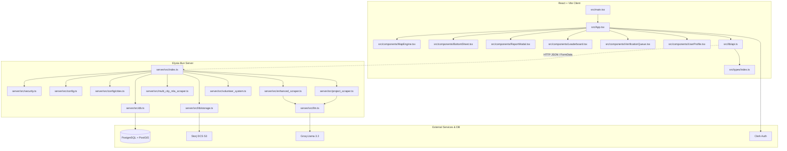

# PLAN: Codebase Analysis & Refactoring

Deep architectural analysis, flow charting, and refactoring plan for the FixIndia.org codebase.

## Overview

FixIndia.org is a civic accountability platform mapping local issues, news, and elected representatives (MLAs/MPs) across major Indian cities. It utilizes a Vite React + TS frontend and an Elysia Bun + PostgreSQL/PostGIS backend, integrated with Storj DCS for image hosting, Groq AI for geocoding scrapers, and Clerk for authentication.

This plan details the complete structural mapping of the codebase, identifies critical bugs and architectural flaws, and outlines the step-by-step implementation required to resolve them.

---

## Codebase Dependency Map



---

## Detailed Component Mapping

### 1. Database Schema (`server/schema.sql`)
*   **`users`**: Civic hero profiles linked via `clerk_id`. Tracks reputation scores (`reports_published`, `reports_verified`, `trust_score`).
*   **`wards`**: Multigeometric ward boundaries (`boundaries::geography`) and MLA details.
*   **`reports`**: Civic issues reported by users or projects parsed from news. Has PostGIS point coordinates (`location::geography`), status, severity, and S3-hosted image URLs.
*   **`local_news`**: Geo-tagged infrastructure news scraped from RSS feeds.
*   **`mlas`**: Political representative tracking per constituency and city.
*   **`pending_verifications`**: Staging area for volunteer submissions.
*   **`volunteer_verifications`**: Individual approvals/rejections of staging submissions.
*   **`upvotes` / `verifications`**: Prevent double-voting/verifying of active reports.

### 2. Backend Scrapers
*   **`enhanced_scraper.ts`**: Aggregates infrastructure news from 30+ RSS feeds, runs them through Groq Llama-3.3 geocoder to extract city, area coordinates, and inserts them into `local_news`.
*   **`project_scraper.ts`**: Specifically sweeps Google News and DIPR for Karnataka infrastructure project sanctions, geocodes details, and populates them as active `reports`.
*   **`multi_city_mla_scraper.ts`**: Scrapes Wikipedia to update constituency lists and MLA names across 6 cities.
*   **`scraper.ts` & `mla_scraper.ts`**: Legacy, fragile HTML scrapers replaced by the above implementations.

### 3. Verification & Volunteer System (`server/src/volunteer_system.ts`)
*   Provides staging capabilities where news, reports, or MLAs submitted by community members are reviewed by volunteers.
*   Implements threshold logic: once a submission reaches 3 verifications with an approval ratio $\ge$ 67%, it is automatically published to its primary table.

---

## Codebase Flaw Analysis

### Flaw 1: Volunteer Auto-Publish Crash (Runtime Bug)
*   **Location**: `server/src/volunteer_system.ts:125` inside `publishVerifiedData()`.
*   **Issue**: Executes `const data = JSON.parse(submission.raw_data)`. However, `raw_data` is defined as a `JSONB` column in `pending_verifications`. The `postgres` query driver automatically deserializes JSONB columns into structured JavaScript objects. Executing `JSON.parse` on an object coerces it to `"[object Object]"` and throws a syntax error: `SyntaxError: Unexpected token o in JSON...`.
*   **Severity**: Critical (crashes verification workflow).

### Flaw 2: Project Scraper Image URL Hijacking & UI Bug (Logic Flaw)
*   **Location**: `server/src/project_scraper.ts:132`, `server/src/index.ts:171`, and `src/components/BottomSheet.tsx:106`.
*   **Issue**: The scraper inserts the news article URL (`item.link`) directly into the `image_url` field of the `reports` table because there is no `source_url` field in the database. The frontend fetches this, treats it as a public image URL, and tries to render it inside an `` tag: ``, resulting in broken images across the UI.
*   **Severity**: High (corrupts reports visualization and breaks UI layout).

### Flaw 3: Dummy Security Controls
*   **Location**: `server/src/security.ts:100-107`.
*   **Issue**: `detectSQLInjection()` and `detectXSS()` simply return `false`. While the database queries use parameterized SQL tagged templates (which prevent SQL Injection), these bypassed hooks fail to block malicious patterns in strings or sanitize dangerous script tags properly.
*   **Severity**: Medium.

### Flaw 4: Redundant Legacy Scrapers & Active Endpoints
*   **Location**: `server/src/scraper.ts`, `server/src/mla_scraper.ts`, and `server/src/index.ts:7,9,543,587`.
*   **Issue**: Legacy HTML scraper files remain in the codebase and are imported and bound to admin endpoints (`/api/scraper/run` and `/api/scraper/mla/run`), leading to dead code and security/maintenance issues.
*   **Severity**: Low.

### Flaw 5: Weak Route Input Validation
*   **Location**: `server/src/index.ts`.
*   **Issue**: Handlers accept bodies as `any` and validate parameters using manual `if/else` checks. This is error-prone, hard to scale, and bypasses Elysia's native `TypeBox` schemas (`t.Object`).
*   **Severity**: Medium.

---

## Action Plan

### Step 1: Database Schema Modifications
*   Add `source_url TEXT` column to the `reports` table in `server/schema.sql` (under line 59).
*   Add `source_url` field to `pending_verifications` raw data structure, if necessary.

### Step 2: Fix Volunteer System Auto-Publish Crash
*   Refactor `publishVerifiedData` in `server/src/volunteer_system.ts` to check if `submission.raw_data` needs parsing:
    ```typescript
    const data = typeof submission.raw_data === 'string' 
      ? JSON.parse(submission.raw_data) 
      : submission.raw_data;
    ```

### Step 3: Refactor Scrapers & News/Reports Integration
*   Delete legacy files: `server/src/scraper.ts` and `server/src/mla_scraper.ts`.
*   Remove legacy imports and `/api/scraper/run` and `/api/scraper/mla/run` routes from `server/src/index.ts`.
*   Update `server/src/project_scraper.ts` to store news links in `source_url` instead of `image_url`. Leave `image_url` as `null` or a default placeholder.
*   Update `reports` SELECT queries in `server/src/index.ts` to fetch the new `source_url` column.
*   Update frontend type definition `Issue` in `src/types/index.ts` to include `sourceUrl?: string`.
*   Update frontend API client mapping in `src/lib/api.ts` to populate `sourceUrl` from response data.
*   Update `src/components/BottomSheet.tsx` to:
    - Avoid rendering `imageUrl` if it does not contain a valid image extension or if it is a general news domain.
    - Render a clickable link "Read Source Article" if `sourceUrl` is present.

### Step 4: Implement Route Schema Validation & Real Security Sanitization
*   Clean up `server/src/security.ts`:
    - Remove dummy `detectSQLInjection` and `detectXSS` functions.
    - Ensure `sanitizeInput` or a robust sanitize pattern is used in text fields.
*   Rewrite route handlers in `server/src/index.ts` to utilize Elysia's native `t.Object` schemas for validation, ensuring parameters are typed (e.g. coordinates are floats, strings have min/max lengths).

---

## Verification Plan

### Automated Tests
- Run `npm run lint` and `npx tsc --noEmit` on frontend and server to verify types compile.
- Create local test script `server/src/test_fixes.ts` using `bun test` to assert:
  - `publishVerifiedData` functions correctly with both stringified and object representation in `raw_data`.
  - Elysia validators reject invalid payloads (e.g. invalid latitude).

### Manual Verification
- Start local backend on port 4000 and frontend on port 5173.
- Verify report details rendering: click an issue created by `project_scraper.ts` and confirm the image box is hidden and a clickable source article link is shown instead.
- Trigger volunteer auto-verification workflow and confirm entries publish to database without crash.
