# PLAN: Codebase Refactoring, Security Hardening, & Bug Fixes

Deep codebase mapping, architecture flow diagrams, flaw analysis, and step-by-step plan for resolving local bugs in the FixIndia codebase.

---

## 🤖 Applying knowledge of `@[code-archaeologist]` and `@[project-planner]`...

## Project Type: WEB + BACKEND
- **Frontend Client**: React v19 + Vite v8 + TypeScript + Mapbox GL & MapLibre GL
- **Backend API Server**: Elysia Bun Server + PostgreSQL + PostGIS (stored geometry bounds)

---

## Codebase Architecture Flow

```mermaid
graph TD
    %% Frontend Subsystem
    subgraph Frontend [React + Vite Client]
        Main[src/main.tsx] --> App[src/App.tsx]
        App --> Map[src/components/MapEngine.tsx]
        App --> Sheet[src/components/BottomSheet.tsx]
        App --> Report[src/components/ReportModal.tsx]
        App --> Verify[src/components/VerificationQueue.tsx]
        App --> Profile[src/components/UserProfile.tsx]
        App --> Menu[src/components/NavigationMenu.tsx]
        App --> Pages[src/components/ContentPages.tsx]
        App --> Dashboard[src/components/LiveabilityDashboard.tsx]
        App --> Trending[src/components/TrendingNews.tsx]
        App --> APIClient[src/lib/api.ts]
        APIClient --> Types[src/types/index.ts]
    end

    %% Backend Subsystem
    subgraph Backend [Elysia Bun Server]
        Server[server/src/index.ts] --> DB[server/src/db.ts]
        Server --> Security[server/src/security.ts]
        Server --> Storage[server/src/lib/storage.ts]
        Server --> Config[server/src/config.ts]
        Server --> Cities[server/src/config/cities.ts]
        Server --> ScraperNews[server/src/enhanced_scraper.ts]
        Server --> ScraperMLA[server/src/multi_city_mla_scraper.ts]
        Server --> ScraperProj[server/src/project_scraper.ts]
        Server --> Volunteer[server/src/volunteer_system.ts]

        ScraperNews --> LLM[server/src/llm.ts]
        ScraperProj --> LLM
    end

    %% External Interfaces
    subgraph External [External Services & Database]
        DB --> Postgres[(PostgreSQL 14+ + PostGIS)]
        Storage --> Storj[Storj DCS S3 Compatible]
        LLM --> Groq[Groq Llama 3.3]
        LLM --> OpenRouter[OpenRouter Free Llama 3.3]
        App --> Clerk[Clerk Authentication]
    end

    %% Communication Channels
    APIClient -.->|HTTP CORS / JSON / FormData| Server
```



---

## Detailed Codebase Map & Directory Layout

### 📁 Root Directory
*   [package.json](file:///Users/foxcorn/Documents/Experiments/fixindia/package.json) - Frontend project configuration, dependencies (Framer Motion, Mapbox, Clerk, React 19).
*   [vite.config.ts](file:///Users/foxcorn/Documents/Experiments/fixindia/vite.config.ts) - Vite build configuration.
*   [index.html](file:///Users/foxcorn/Documents/Experiments/fixindia/index.html) - Application wrapper.

### 📁 Frontend: `src/`
*   [main.tsx](file:///Users/foxcorn/Documents/Experiments/fixindia/src/main.tsx) - Client entry point, Clerk provider wrapping.
*   [App.tsx](file:///Users/foxcorn/Documents/Experiments/fixindia/src/App.tsx) - Main page layout, geolocating handlers, and client state orchestration.
*   [index.css](file:///Users/foxcorn/Documents/Experiments/fixindia/src/index.css) - Global Tailwind / custom CSS tokens.
*   #### `src/components/`
    *   [MapEngine.tsx](file:///Users/foxcorn/Documents/Experiments/fixindia/src/components/MapEngine.tsx) - Renders interactive Mapbox/MapLibre map with geodata markers.
    *   [BottomSheet.tsx](file:///Users/foxcorn/Documents/Experiments/fixindia/src/components/BottomSheet.tsx) - Interactive bottom tray showing issue detail cards and news lists.
    *   [ReportModal.tsx](file:///Users/foxcorn/Documents/Experiments/fixindia/src/components/ReportModal.tsx) - Form overlay allowing citizens to pin and document new civic issues.
    *   [VerificationQueue.tsx](file:///Users/foxcorn/Documents/Experiments/fixindia/src/components/VerificationQueue.tsx) - Interface for volunteers to review, approve, or reject submissions.
    *   [UserProfile.tsx](file:///Users/foxcorn/Documents/Experiments/fixindia/src/components/UserProfile.tsx) - Displays user status, stats, and leaderboard ranks.
    *   [Leaderboard.tsx](file:///Users/foxcorn/Documents/Experiments/fixindia/src/components/Leaderboard.tsx) - Citizen civic score and MLA Wall of Shame tables.
    *   [TrendingNews.tsx](file:///Users/foxcorn/Documents/Experiments/fixindia/src/components/TrendingNews.tsx) - Trending civic/news lists in the area.
    *   [LiveabilityDashboard.tsx](file:///Users/foxcorn/Documents/Experiments/fixindia/src/components/LiveabilityDashboard.tsx) - Shows local ward indices.
    *   [NavigationMenu.tsx](file:///Users/foxcorn/Documents/Experiments/fixindia/src/components/NavigationMenu.tsx) - Drawer menu.
    *   [SplashScreen.tsx](file:///Users/foxcorn/Documents/Experiments/fixindia/src/components/SplashScreen.tsx) - Brand introductory splash screen.
*   #### `src/types/`
    *   [index.ts](file:///Users/foxcorn/Documents/Experiments/fixindia/src/types/index.ts) - TypeScript data types.
*   #### `src/lib/`
    *   [api.ts](file:///Users/foxcorn/Documents/Experiments/fixindia/src/lib/api.ts) - API requests wrapper mapping client models to backend responses.

### 📁 Backend: `server/`
*   [package.json](file:///Users/foxcorn/Documents/Experiments/fixindia/server/package.json) - Backend Bun dependencies.
*   [schema.sql](file:///Users/foxcorn/Documents/Experiments/fixindia/server/schema.sql) - Database tables, constraints, GIST spatial indexes.
*   [deploy.sh](file:///Users/foxcorn/Documents/Experiments/fixindia/server/deploy.sh) - PM2 deploy scripts.
*   [ecosystem.config.json](file:///Users/foxcorn/Documents/Experiments/fixindia/server/ecosystem.config.json) - PM2 environment definition.
*   #### `server/src/`
    *   [index.ts](file:///Users/foxcorn/Documents/Experiments/fixindia/server/src/index.ts) - Primary server routing, cron setups, and route logic.
    *   [db.ts](file:///Users/foxcorn/Documents/Experiments/fixindia/server/src/db.ts) - Postgres driver pool config.
    *   [config.ts](file:///Users/foxcorn/Documents/Experiments/fixindia/server/src/config.ts) - Environment variables scanner.
    *   [llm.ts](file:///Users/foxcorn/Documents/Experiments/fixindia/server/src/llm.ts) - ChatCompletion requests mapping for Groq/OpenRouter.
    *   [security.ts](file:///Users/foxcorn/Documents/Experiments/fixindia/server/src/security.ts) - Fingerprinting, rate limiter, header settings, sanitizers.
    *   [volunteer_system.ts](file:///Users/foxcorn/Documents/Experiments/fixindia/server/src/volunteer_system.ts) - Community staging queue processing.
    *   [enhanced_scraper.ts](file:///Users/foxcorn/Documents/Experiments/fixindia/server/src/enhanced_scraper.ts) - Multi-city RSS feed consumer and LLM geocoder.
    *   [project_scraper.ts](file:///Users/foxcorn/Documents/Experiments/fixindia/server/src/project_scraper.ts) - Sweeps tenders/sanction news, saving them as reports.
    *   [multi_city_mla_scraper.ts](file:///Users/foxcorn/Documents/Experiments/fixindia/server/src/multi_city_mla_scraper.ts) - Wikipedia scraping for local MLA names.
    *   [scraper.ts](file:///Users/foxcorn/Documents/Experiments/fixindia/server/src/scraper.ts) - (LEGACY) Old single-feed news scraper.
    *   [mla_scraper.ts](file:///Users/foxcorn/Documents/Experiments/fixindia/server/src/mla_scraper.ts) - (LEGACY) Old HTML MLA scraper.
    *   [seed.ts](file:///Users/foxcorn/Documents/Experiments/fixindia/server/src/seed.ts) - Initial mock data population scripts.

---

## Database Schema & Integration Detail

The database schema (`server/schema.sql`) enforces proper referential integrity and spatial queries. Key mappings include:

*   **Spatial Queries**: PostGIS GIST indexes on `reports(location)`, `local_news(location)`, and `wards(boundaries)` allow fast point-in-polygon (`ST_Contains`) and bounding box search (`ST_Intersects`).
*   **Volunteers Staging**: Submissions enter `pending_verifications` with `data_type` in `('report', 'news', 'mla')`. Individual volunteer entries are saved in `volunteer_verifications`. Auto-publishing triggers when threshold is reached.

---

## Detailed Flaw Analysis

### Flaw 1: Volunteer Staging Deserialization Crash (Runtime Bug)
*   **Location**: `server/src/volunteer_system.ts:125` inside `publishVerifiedData()`.
*   **Issue**: Executes `const data = JSON.parse(submission.raw_data)`. However, `raw_data` is defined as a `JSONB` column in `pending_verifications`. The `postgres` query driver automatically deserializes JSONB columns into structured JavaScript objects. Running `JSON.parse` on an object forces a string coercion to `"[object Object]"` which fails with `SyntaxError: Unexpected token o in JSON...`.
*   **Impact**: Crashes the verification queue publication flow completely.

### Flaw 2: Project Scraper Image URL Hijacking & UI Bug (Logic Flaw)
*   **Location**: `server/src/project_scraper.ts:132` and `src/components/BottomSheet.tsx:106`.
*   **Issue**: The scraper inserts the news article URL (`item.link`) directly into the `image_url` field of the `reports` table because there is no `source_url` field in the database. The React client fetches this and blindly renders it inside an `` tag: ``, resulting in broken images on reports scraped from news.
*   **Impact**: Ruined UX with empty/broken image placeholders on reports.

### Flaw 3: Dummy Security Validation Hooks
*   **Location**: `server/src/security.ts:100-107`.
*   **Issue**: The `detectSQLInjection` and `detectXSS` checkers are hardcoded to return `false`, bypassing real runtime payload validation.
*   **Impact**: Security validation middleware is mocked and inactive.

### Flaw 4: Active Routes Bound to Redundant Legacy Scrapers
*   **Location**: `server/src/index.ts:7,9,543,587`.
*   **Issue**: Legacy scraper files `scraper.ts` and `mla_scraper.ts` remain active and are imported and bound to routes `/api/scraper/run` and `/api/scraper/mla/run`.
*   **Impact**: Dead legacy code polluting backend resources.

### Flaw 5: Weak Route Input Parameter Verification
*   **Location**: `server/src/index.ts`.
*   **Issue**: Handlers accept bodies as `any` and validate parameters using manual `if/else` checks, bypassing Elysia's native `TypeBox` schemas (`t.Object`).
*   **Impact**: Unsafe payload handling and reduced schema maintainability.

---

## Action Plan (Local Implementation & Bug Fixes)

> [!WARNING]
> **Strict Local Execution**: Under no circumstances will code be committed or pushed to remote GitHub repositories during this work. All verification and fixes will be executed locally.

### Step 1: Database Migration
- Modify `server/schema.sql` to include `source_url TEXT` column on `reports`.
- Apply migration locally.

### Step 2: Fix Volunteer System Auto-Publish Crash
- Update `publishVerifiedData` in `server/src/volunteer_system.ts` to check types before parsing:
  ```typescript
  const data = typeof submission.raw_data === 'string'
    ? JSON.parse(submission.raw_data)
    : submission.raw_data;
  ```

### Step 3: Refactor Scrapers & News/Reports Integration
- Delete legacy files `server/src/scraper.ts` and `server/src/mla_scraper.ts`.
- Clean up legacy routes and imports in `server/src/index.ts`.
- Update `server/src/project_scraper.ts` to write links to `source_url` and leave `image_url` empty or null. Update local deduplication to query `source_url`.
- Update `reports` SELECT statements in `server/src/index.ts` to include `source_url` retrieval.

### Step 4: Refactor Frontend Components
- Update `Issue` interface in `src/types/index.ts` to include `sourceUrl?: string`.
- Update mapping in `src/lib/api.ts` to retrieve and format `sourceUrl`.
- Modify `src/components/BottomSheet.tsx` to:
  - Validate image format of `imageUrl` before trying to render an image container.
  - Display a clean "Read Source Article" link when `sourceUrl` is present.

### Step 5: Route Schema Validation & Security Controls
- Implement real validation checks in `server/src/security.ts` to replace dummy functions.
- Update route schemas in `server/src/index.ts` using Elysia's native `t.Object` validators.

---

## Success Criteria & Verification Plan

### Automated Checks
- [ ] Run `npm run lint` and verify no errors.
- [ ] Run `npx tsc --noEmit` and verify code compiles cleanly.
- [ ] Execute `python .agent/scripts/checklist.py .` and verify all tests pass.

### Manual Verification
- [ ] Verify local backend server runs on `http://localhost:4000`.
- [ ] Verify local frontend web server runs on `http://localhost:5173`.
- [ ] Trigger volunteer auto-publish flow and confirm database updates without crash.
- [ ] Trigger scrapers and verify news articles show link buttons without broken images.

### Rules Verification
- [ ] No purple/violet color hex codes.
- [ ] No standard templates used.
- [ ] Socratic Gate was respected.
